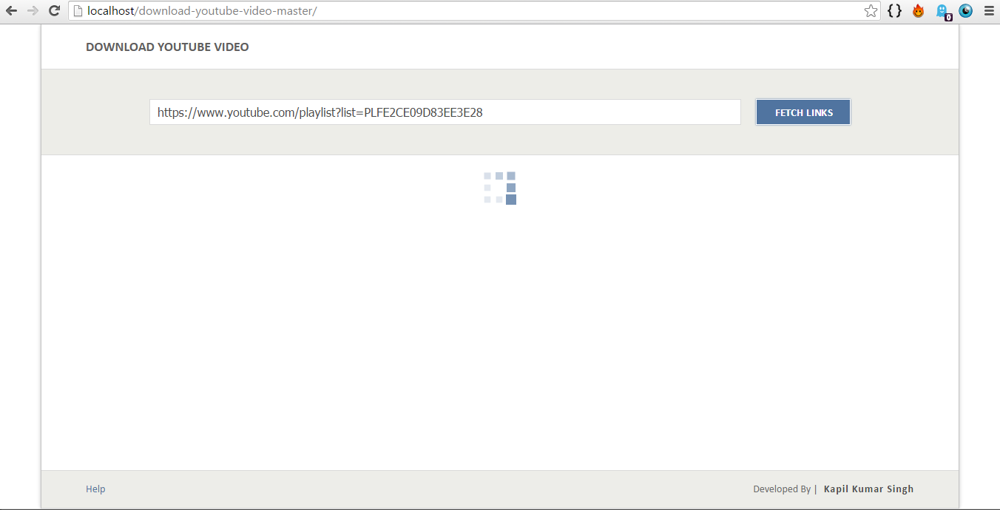
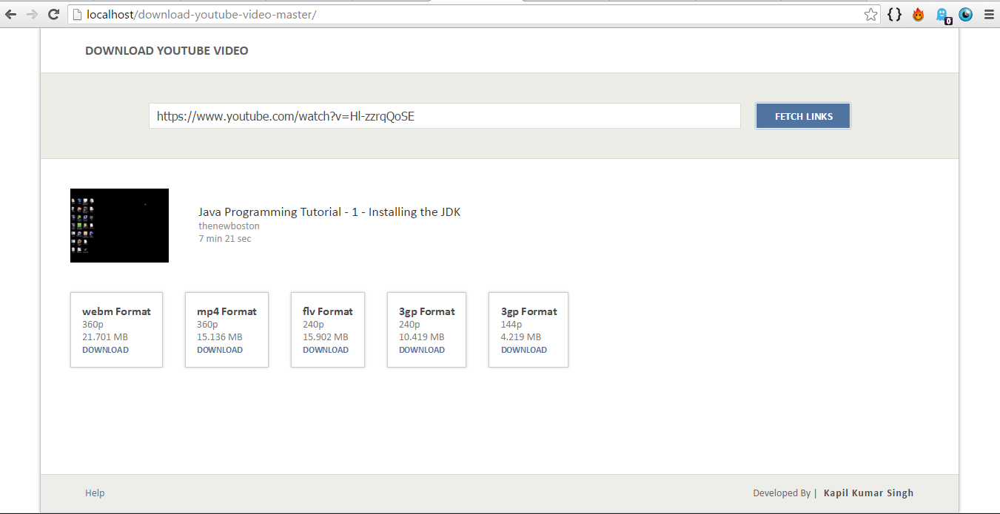
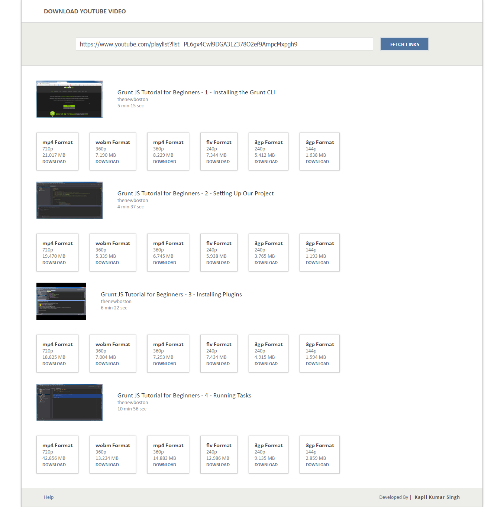

# Download-youtube-video

> An app for fetching the link to video files of youtube in different video formats

Script `fetchYoutube.php` do all the work for getting the links for videos passed<br/> as `url` parameter and output them as **JSON object**.

It also support extracting all video from a playlist.

**YouTube Data API v3** is used to get details about videos and playlist.

## Use
  Pass link to video as `url` paramater to `fetchYoutube.php`
  
  - For getting single video pass `videoId` in link for `v` parameter 

      ```
      fetchYoutube.php?url=https://www.youtube.com/watch?v=videoId
      ```
  - For getting the whole playlist use `playlistId` for `list` parameter
  
      ```
      fetchYoutube.php?url=https://www.youtube.com/playlist?list=playlistId
      ```
      
      or pass `videoId` of any video of playlist , `playlistId` and `all=true`
      
      ```
      fetchYoutube.php?url=https://www.youtube.com/watch?v=videoId&list=playlistId&all=true
      ```
      
## Screenshots
  
  1. ###### Home Page
    
  

  2. ###### Fetching links for single video
    
  
  
  3. ###### Fetching links for whole playlist
    